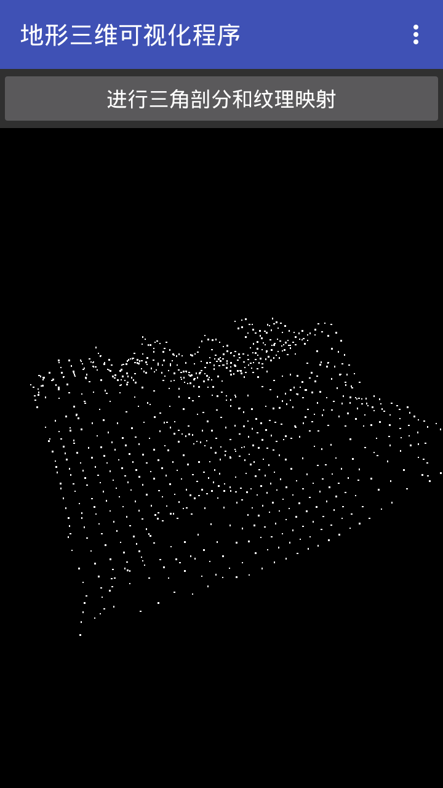
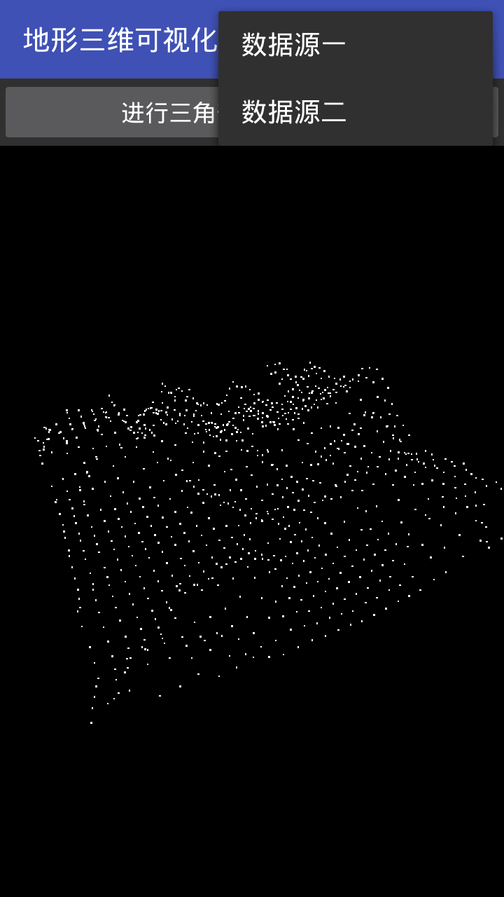
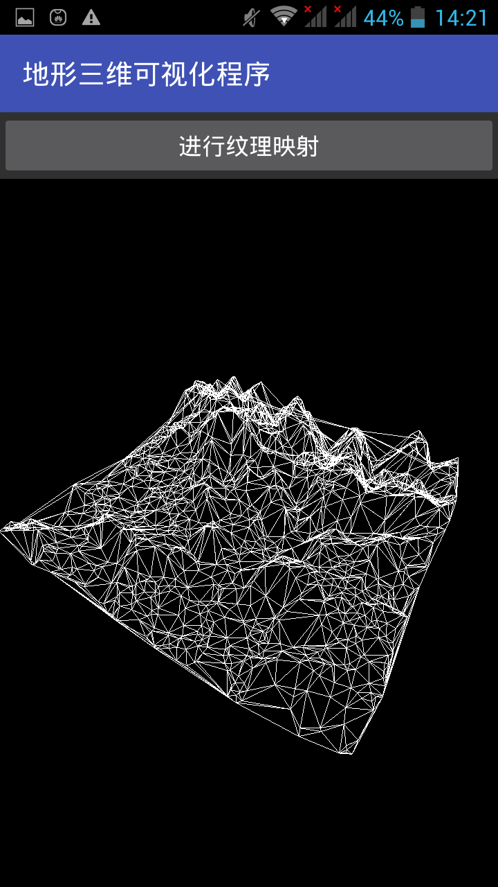
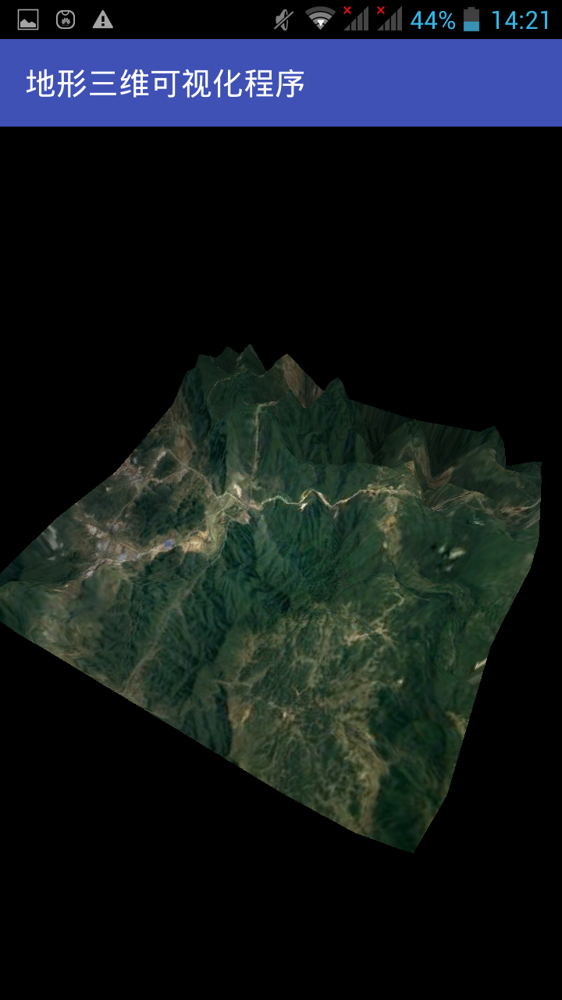

# 3D-terrain-visualization  
This a android application that based on openGL ES API, which is used for terrain visualizaton.  
The program implements the following functions:  
（1）Display 3D scatter points;  
（2）Delaunay triangulation for points;  
（3）Texture mapping;  
（4）Set the viewport, add light.  
  
这是一个基于openGL ES的三维地形可视化安卓程序。  
该程序实现的功能：  
（1）展示三维散点地形数据；  
（2）将三维散点图进行Delaunay三角剖分，生成三角网；  
（3）给三角网贴上地形纹理；  
（4）设置视角变换，加上光照。
## 三维散点图绘制：  
   
   
## 三角剖分： 
  
## 贴图渲染:   
  
## 项目导入:  
下载本项目后，用Android studio打开。  
## 结束语:  
欢迎各位高手提出意见，共同进步！
